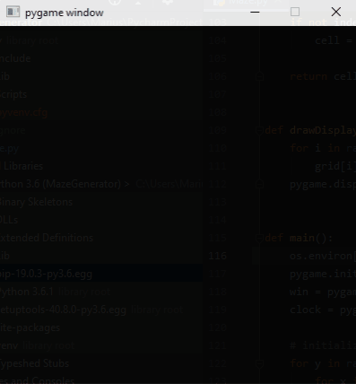

# MazeGenerator

Small project for generating a maze with a [recursive backtracking](https://en.wikipedia.org/wiki/Maze_generation_algorithm#Recursive_backtracker "Backtracking algorithm described on Wikipedia") algorithm.

For displaying purpose I used the library pygame.

## Demo



## Requirements
```A working python installation```

## How to run

```
git clone https://github.com/CaptainKappa/MazeGenerator.git
cd MazeGenerator
pip install pygame
py Maze.py
```
